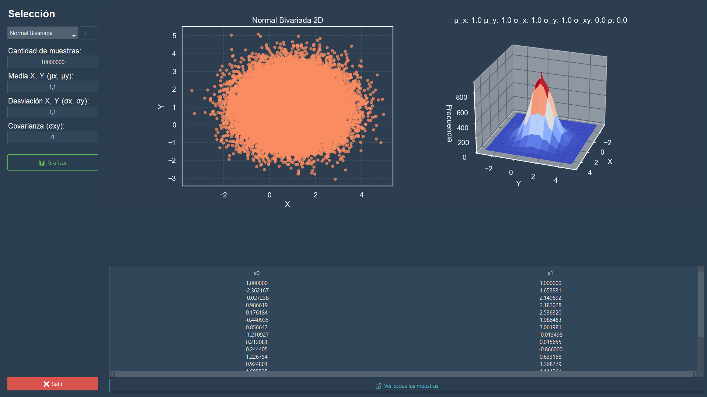
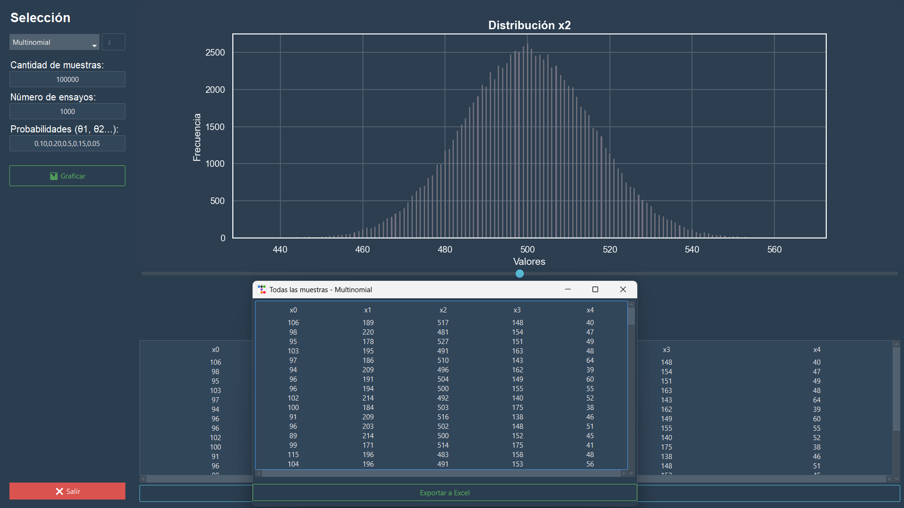

# Simulador de Distribuciones y MCMC (Python + C)

Este proyecto es un simulador de distribuciones de probabilidad y algoritmos de muestreo. Utiliza una arquitectura híbrida con un motor de cálculo desarrollado en **C** para máxima eficiencia y una interfaz gráfica moderna en **Python**.

##  Galería

| Vista Principal (3D) | Configuración MCMC (Expresiones) |
| :---: | :---: |
|  <br> *Visualización de Normal Bivariada 3D* |  <br> *Muestreo MCMC evaluando funciones dinámicamente* |

| Distribución Multinomial | Exportación de Datos |
| :---: | :---: |
|  <br> *Interactividad con múltiples dimensiones* |  <br> *Previsualización y exportación a .xlsx* |

## Características Principales

* **Motor de Cálculo en C:** Implementación de algoritmos estadísticos de bajo nivel para optimizar el rendimiento en simulaciones de gran escala.
* **MCMC Avanzado:** Soporte para muestreo de Gibbs y Metropolis-Hastings (1D y 2D, continuo y discreto) con evaluación dinámica de funciones mediante `tinyexpr`.
* **Visualización Dinámica:** Generación de histogramas 2D y superficies de frecuencia 3D utilizando Matplotlib y Seaborn.
* **Interfaz Profesional:** UI construida con `ttkbootstrap` (tema Superhero) que soporta visualización de datos en tiempo real y exportación a Excel.

## Stack Tecnológico

* **Frontend:** Python 3.x, Tkinter, ttkbootstrap.
* **Análisis y Gráficos:** NumPy, Pandas, Matplotlib, Seaborn, SciPy.
* **Backend:** C (compilado como DLL/Shared Object).
* **Interoperabilidad:** `ctypes` para la comunicación Python-C.

## Distribuciones Soportadas

* **Discretas:** Binomial, Binomial Puntual, Multinomial, Metropolis-Poisson.
* **Continuas:** Normal, Exponencial, Normal Bivariada, Metropolis-Beta.
* **MCMC:** Muestreo de Gibbs (Triangular, Lineal, Funciones personalizadas f(x,y)).

## Instalación y Configuración

Dado que este proyecto combina una interfaz en Python con un motor de cálculo en C, requiere compilar la librería dinámica antes de su ejecución. Sigue estos pasos para configurar el entorno correctamente.

### Requisitos Previos
* **Python 3.8+** instalado en tu sistema.
* **Compilador de C:**
  * **Windows:** GCC (puedes instalarlo a través de [MinGW-w64](https://www.mingw-w64.org/) o MSYS2).
  * **Linux:** `gcc` y `build-essential` (`sudo apt install build-essential`).
  * **macOS:** Xcode Command Line Tools (`xcode-select --install`).

### Paso a paso

**1. Clonar el repositorio y organizar los directorios**
El código asume una estructura de carpetas específica. Asegúrate de clonar el repositorio y de que tu directorio de trabajo luzca así:

```text
Graficacion/
├── build/   
|   ├── FuncionDensidad.dll           # Aquí se generará y guardará la DLL/SO
├── python/                # Scripts de la interfaz y visualización
│   ├── FuncionDensidad.py
│   ├── Graficacion.py
│   ├── Interfaz.py
│   ├── Thread.py
│   └── requeriments.txt
└── src/                   # Código fuente en C
    └── Motor_c/
        ├── FuncionDensidad.c
        ├── FuncionDensidad.h
        └── tinyexpr.c
```

Ejecuta en tu terminal:

```bash
git clone [https://github.com/tu-usuario/Simulacion.git](https://github.com/tu-usuario/Simulacion.git)
cd Simulacion
mkdir build
```

**2. Crear un entorno virtual e instalar dependencias**
Es recomendable usar un entorno virtual para mantener las dependencias aisladas.

```bash
python -m venv venv
venv\Scripts\activate

# Instalar los paquetes necesarios
pip install -r requeriments.txt
```

**3. Compilar el motor matemático en C**
Debes compilar el código C como una librería dinámica en la carpeta `build/`. En Windows usando GCC, el comando es:

```bash
gcc -shared -o build/FuncionDensidad.dll src/FuncionDensidad.c src/tinyexpr.c -O3 -lm
```
*(Para Linux, cambia la extensión de salida a `.so` y añade la bandera `-fPIC`).*

**4. Ejecutar la aplicación**
Finalmente, entra a la carpeta del código fuente y lanza la interfaz:

```bash
cd src
python Interfaz.py
```

